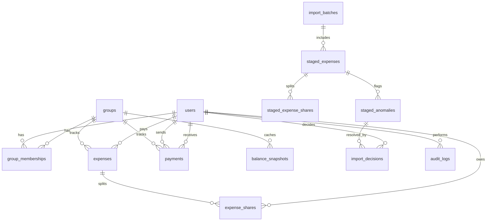

# Scope & Specifications Document

This document records the data models, entity relationships, Varying Tenure validations, and complete Anomaly Matrix parameters for the Shared Expenses application.

---

## 1. Database Entity Relationship Diagram (ERD)

---

## 2. Table Schemas (PostgreSQL Types)

- **`users`**: `id` (SERIAL PK), `username` (VARCHAR 100 UNIQUE), `password_hash` (VARCHAR 255)
- **`groups`**: `id` (SERIAL PK), `name` (VARCHAR 255)
- **`group_memberships`**: `id` (SERIAL PK), `group_id` (FK), `user_id` (FK), `joined_date` (DATE), `left_date` (DATE NULLABLE).
- **`expenses`**: `id` (SERIAL PK), `group_id` (FK), `description` (VARCHAR 255), `original_amount_paise` (INTEGER), `original_currency` (VARCHAR 10), `exchange_rate` (NUMERIC 12,6), `converted_amount_paise` (INTEGER), `date` (DATE), `paid_by_id` (FK), `split_type` (VARCHAR 50), `category` (VARCHAR 100), `import_batch_id` (FK NULLABLE).
- **`expense_shares`**: `id` (SERIAL PK), `expense_id` (FK), `user_id` (FK), `share_amount_paise` (INTEGER).
- **`payments`**: `id` (SERIAL PK), `group_id` (FK), `from_user_id` (FK), `to_user_id` (FK), `amount_paise` (INTEGER), `date` (DATE), `notes` (TEXT).
- **`balance_snapshots`**: `id` (SERIAL PK), `group_id` (FK), `user_id` (FK), `calculated_at` (TIMESTAMP), `net_balance_paise` (INTEGER), `paid_amt_paise` (INTEGER), `owed_amt_paise` (INTEGER), `settlements_sent_paise` (INTEGER), `settlements_received_paise` (INTEGER).
- **`staged_expenses`**: `id` (SERIAL PK), `batch_id` (FK), `row_number` (INTEGER), `description` (VARCHAR), `raw_amount` (VARCHAR), `raw_currency` (VARCHAR), `raw_date` (VARCHAR), `raw_paid_by` (VARCHAR), `raw_split_type` (VARCHAR), `raw_split_details` (TEXT), `category` (VARCHAR), `status` (VARCHAR).
- **`staged_anomalies`**: `id` (SERIAL PK), `staged_expense_id` (FK), `anomaly_type` (VARCHAR 50), `severity` (VARCHAR 20), `description` (TEXT), `proposed_correction` (TEXT).
- **`import_decisions`**: `id` (SERIAL PK), `anomaly_id` (FK), `decision` (VARCHAR 50), `decision_by` (FK), `decision_time` (TIMESTAMP), `notes` (TEXT).
- **`audit_logs`**: `id` (SERIAL PK), `timestamp` (TIMESTAMP), `user_id` (FK), `action` (VARCHAR 100), `target_type` (VARCHAR 50), `target_id` (INTEGER), `details` (JSONB).

---

## 3. Varying Tenure & Dynamic Splits Rules
Flatmates have active occupancy date windows:
1. When splitting an expense, active members are queried:
   $$\text{ActiveMembers} = \{ U \in \text{Group} \mid \text{joined\_date} \le \text{expense.date} \land (\text{left\_date} \text{ IS NULL} \lor \text{left\_date} \ge \text{expense.date}) \}$$
2. Expenses split only among the active members on that date.
3. If the CSV specifies inactive members, an anomaly `SPLIT_MEMBER_OUTSIDE_TENURE` (Warning) is flagged. If approved, the system redistributes the share only to active members.

---

## 4. Anomaly Matrix & Catalog

The validation engine detects the following anomalies:

- **A01: Duplicate Row (Warning)**: Row matches existing date, paise, payer, and desc. *Policy: Propose skipping.*
- **A02: Missing Currency (Info)**: No currency symbol or value. *Policy: Auto-default to INR.*
- **A03: Foreign Currency (Info)**: Non-INR currency. *Policy: Convert to paise at database exchange rate.*
- **A04: Currency Symbol in Amount (Info)**: Non-numeric symbols (₹, $, Rs) in amount. *Policy: Clean and parse.*
- **A05: Inconsistent Casing/Spaces (Info)**: Spaces or casings in payer name. *Policy: Trim and map to User.*
- **A06: Payer Not Registered (Hard Error)**: Payer is not in the system. *Policy: Block commit until mapped to user.*
- **A07: Payer Outside Tenure (Hard Error)**: Payer is not active on transaction date. *Policy: Block commit.*
- **A08: Split Member Outside Tenure (Warning)**: Split list has inactive user. *Policy: Propose excluding and redistributing.*
- **A09: Percentage Split Total Error (Warning)**: Split percents != 100%. *Policy: Propose rescaling.*
- **A10: Exact Split Total Error (Warning)**: Split sums != total. *Policy: Propose allocating delta to payer.*
- **A11: Negative/Zero Amount (Warning/Error)**: Negative: treat as **Refund Candidate**. Zero: hard error.
- **A12: Malformed Date (Warning/Error)**: Unstandardized date text. *Policy: Parse fallbacks. Fail if unparseable.*
- **A13: Settlement in Expense Sheet (Warning)**: Suggests peer payment. *Policy: Propose promoting to Payment.*
- **A14: Empty Description (Info)**: Description is blank. *Policy: Auto-default to "Imported Expense <Category>".*
- **A15: Future Date (Warning)**: Transaction date is in future. *Policy: Flag warning, import if user confirms.*
- **A16: Outlier Amount (Warning)**: Expense exceeds ₹100,000. *Policy: Flag warning for manual review.*
